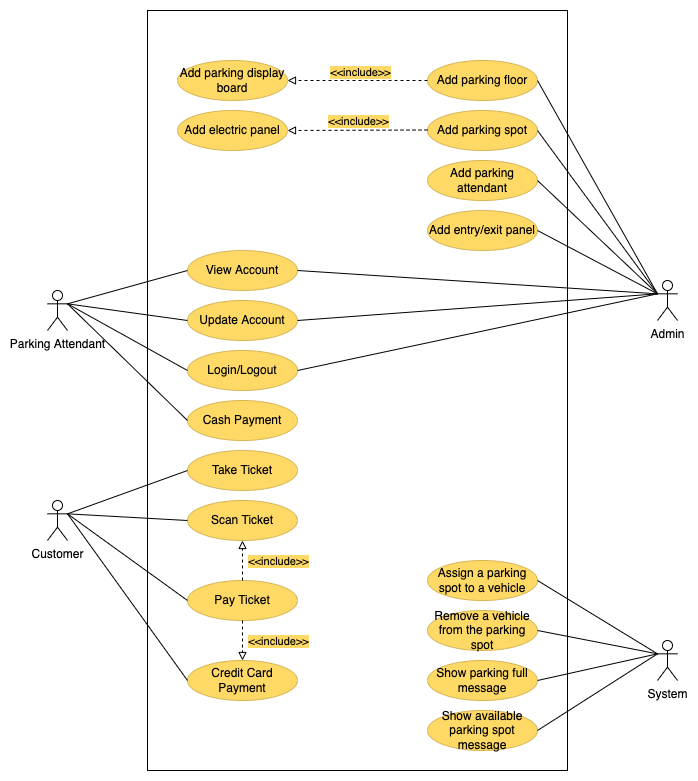

# Parking Lot

## Requirements
1. The parking lot should have multiple floors where customer can park their car
2. The parking should shave multiple entry and exit points
3. Customers can collect ticket at the entry point and pay the parking fee at the exit point
4. Customers can pay the ticket at the automated exit panel or to the parking attendant
5. Customers can pay via both cash and credit cards
6. The system should not allow more vehicles than the maximum capacity
7. Each parking floor will have multiple type of parking spots such as Compact, Large, Handicapped, Motorcycle, etc.
8. The parking spot should have few spots specified for electric cars. These spots should have electric chargers through which customers can pay and charge their vehicles
9. The system should support parking for different types of vehicles like car, truck, van, motorcycle, etc.
10. Each parking floor should have display board showing any free parking spot for each spot type

## Use Case Diagram
Main actors in the system are:
- Admin
- Customer
- Parking Attendant
- System

Top use cases for parking lot
- Add/Edit/Remove the parking floors
- Add/Edit/Remove the parking spots
- Add/Edit/Remove the entry/exit panels
- Take ticket
- Scan ticket
- Credit card payment
- Cash payment

## Class Diagrams
Main classes of our parking lot systems are:
- ParkingLot
- ParkingFloors
- ParkingSpot
- Account
- Ticket
- EntrancePanel
- ExitPanel
- Vehicle
- Payment
- ParkingDisplayBoard
- ParkingAttendantPortal
- CustomerInfoPortal
- ElectricPanel

## Activity Diagrams

## Test Cases

