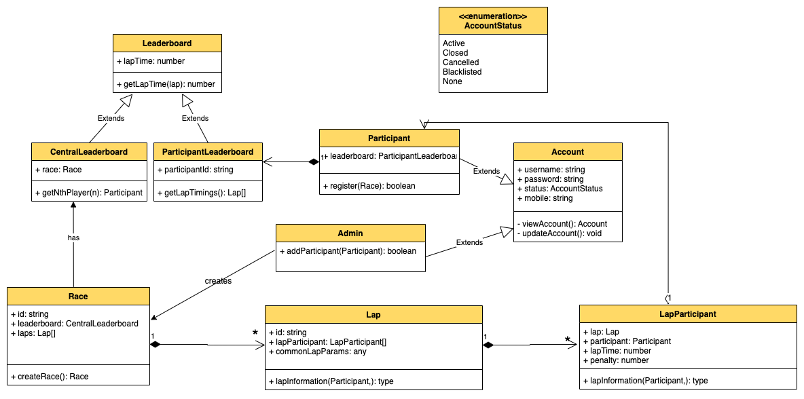

# F1 Racing 

## Requirements
1. Races/Events are held mutually exclusively.
2. A person can participate in any number of races.
3. Person needs to register for the race by giving basic info.
4. Only admin can add registered participants to the race.
5. Person needs to scan QR code to verify their participation in the race.
6. We will be getting information of each lap such as time, penalty, total time, etc. after each lap.
7. This data should be consumed to show 2 leaderboards:
   1. Participant's statistics
   2. Central leaderboard giving ranks of all participants

## Assumptions
1. Everyone has same vehicle
   
## Use Case Diagram
Main actors in the system are:
- Admin
- Participant
- System

Top use cases
- Add/Edit/Remove participants
- Add/Edit/Remove event/race
- Disqualify participant not reaching the event before start
- Updating participant's leaderboard
- Updating central leaderboard

## Class Diagrams
Main classes of our parking lot systems are:
- Account
- Admin
- Participant
- Race
- Lap
- Leaderboard
- ParticipantLeaderboard
- CentralLeaderboard

## Activity Diagrams

## Test Cases

