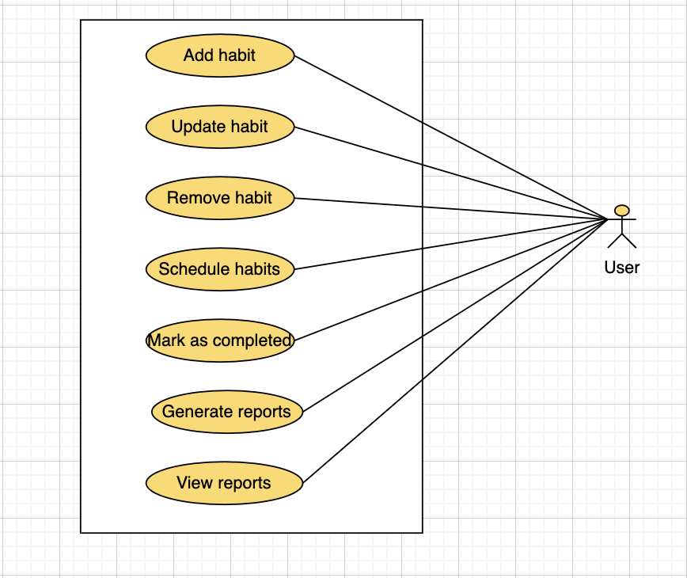

# Habit Tracker

## version-1(V1)
### Requirements

1. Create an app to track any habit.
2. It should be generic enough to add any kind of habit.
3. There should be a to-do kind of list where the activities can be placed on a calendar.
4. There should be an option to mark them completed when done.
5. There should be reports showing different kind of metrics for different activities:
   1. Completion percentage by activity/time-period/etc.
   2. Total time by activity

### Use Case Diagram

Main actors in the system are:
- *User*

**Top use cases:**
- Add a habit
- Update a habit
- Remove a habit
- Plan and schedule the habits in calendar
- Update the plan schedule for completion
- Generate reports

### Class Diagram

Main classes are:
- Habit
- HabitSchedule
- HabitScheduleInstance

### Activity Diagrams

---

## version-2(V2)
### Requirements
1. There should also be more specific version of app where user can select any specific activity and get a detailed tracking.
2. The detailed tracking can be limited to specific activities. For starting we can include just `GYM` activity.
3. For Gym, we should have detailed exercise planner, showing exercise, sets, reps, rest time, etc. to be done. There should also be the option to add how much of it was done.
